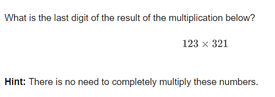
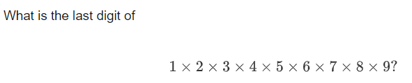
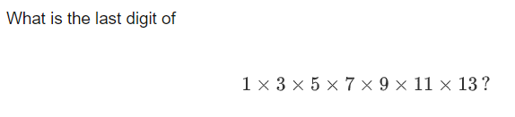
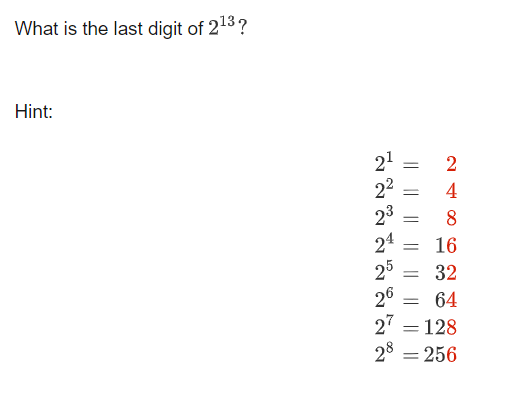
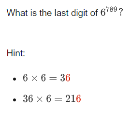
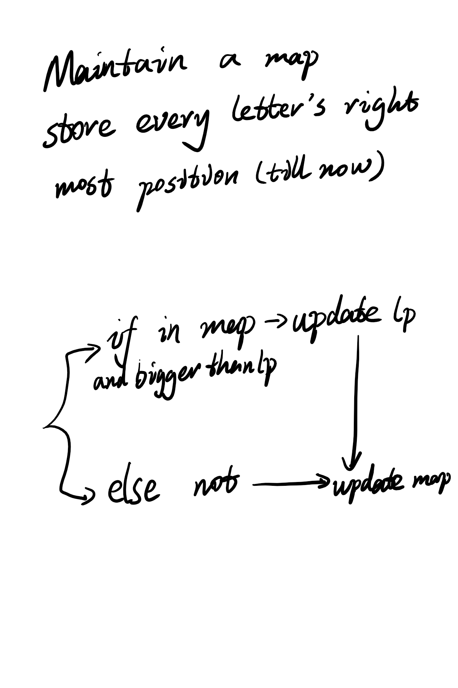

+++
title = "2018-12-19 Daily Challenge"
path = "2018-12-19-daily-challenge"
date = 2018-12-19T11:00:09+00:00
updated = 2020-09-19T20:01:27.625333+00:00
description = "每日挑战"

[taxonomies]
tags = [ "Math", "NumberTheory", "Brilliant", "Algorithm", "LeetCode",]
categories = [ "DailyChallenge",]
archives = [ "archive",]
+++
What I've done today is *Last Digits* of *Number Theory* and *Longest Substring Without Repeating Characters* in *JavaScript*.

If no source is provided, then I'm doing these challenge at https://brilliant.org and https://leetcode.com/.

<!-- more -->

# Math




On the first view of problem, there comes the answer is three.




Five times an even number is zero, whatever number time zero is zero.




Five times an odd number is five.




Obviously there is loop (2->4->8->6) in the multiply chain.




So obvious~

# Algorithm

## Problem

```
3. Longest Substring Without Repeating Characters

Given a string, find the length of the longest substring without repeating characters.

Example 1:

Input: "abcabcbb"
Output: 3 
Explanation: The answer is "abc", with the length of 3. 
Example 2:

Input: "bbbbb"
Output: 1
Explanation: The answer is "b", with the length of 1.
Example 3:

Input: "pwwkew"
Output: 3
Explanation: The answer is "wke", with the length of 3. 
             Note that the answer must be a substring, "pwke" is a subsequence and not a substring.
```

## Solution



## Implementation

```javascript
/**
 * @param {string} s
 * @return {number}
 */
var lengthOfLongestSubstring = function(s) {
    let map = new Map();
    let lp = 0;
    let ans = 0;
    let len = s.length;
    for(let i = 0; i < len ; ++i){
        if(map.has(s[i]) && lp < map.get(s[i]) + 1) lp = map.get(s[i]) + 1;
        ans = ans > ( i - lp + 1 ) ? ans : ( i - lp + 1 );
        //console.log(ans,lp)
        map.set(s[i], i);
    }
    return ans;
};

//console.log(lengthOfLongestSubstring("abba"));
```