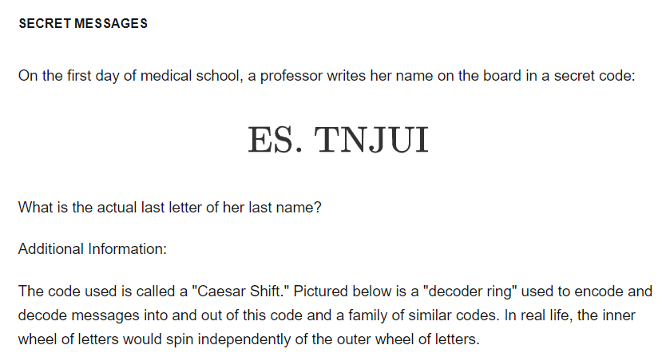
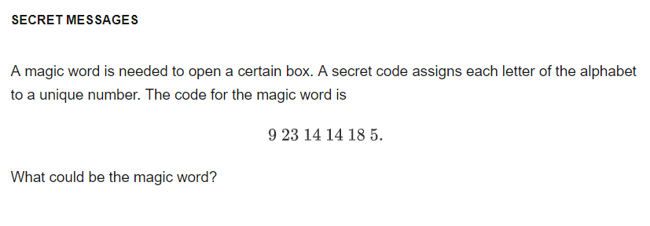
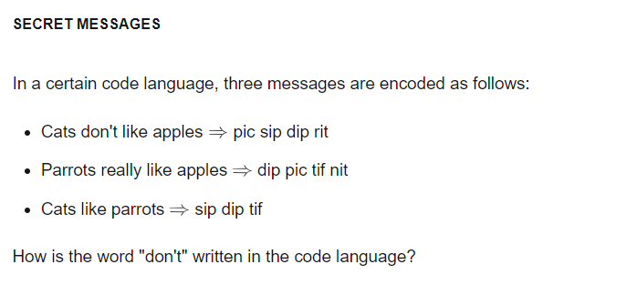
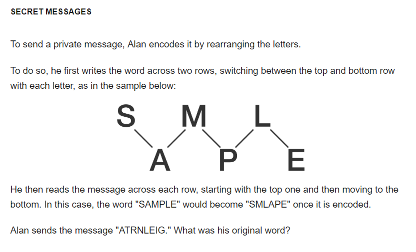

+++
title = "2018-12-20 Daily Challenge"
path = "2018-12-20-daily-challenge"
date = 2018-12-20T00:09:07+00:00
updated = 2020-09-19T20:01:27.624335+00:00
description = "每日挑战"
in_search_index = true

[taxonomies]
tags = [ "Math", "NumberTheory", "Brilliant", "Algorithm", "LeetCode",]
categories = [ "DailyChallenge",]
archives = [ "archive",]
+++
What I've done today is *Secret Messages* of *Number Theory* and *Course Schedule II* in *JavaScript*.

Due to the high cost of \[brilliant.org\]'s subscription, and low difficulty, I decide to change to https://projecteuler.net. So again, if there is no source provided, I'm doing challenge with it and https://LeetCode.com

<!-- more -->

# Math



Ha, Caesar cipher! Dr. Smith.


Emmmm......



......



"like" is "dip", "cats" is "sip", "parrots" is "tif", apples is "nit", "don't" is "rit".



Fence cipher.

# Algorithm

## Problem

```
210. Course Schedule II

There are a total of n courses you have to take, labeled from 0 to n-1.

Some courses may have prerequisites, for example to take course 0 you have to first take course 1, which is expressed as a pair: [0,1]

Given the total number of courses and a list of prerequisite pairs, return the ordering of courses you should take to finish all courses.

There may be multiple correct orders, you just need to return one of them. If it is impossible to finish all courses, return an empty array.

Example 1:

Input: 2, [[1,0]] 
Output: [0,1]
Explanation: There are a total of 2 courses to take. To take course 1 you should have finished   
             course 0. So the correct course order is [0,1] .
Example 2:

Input: 4, [[1,0],[2,0],[3,1],[3,2]]
Output: [0,1,2,3] or [0,2,1,3]
Explanation: There are a total of 4 courses to take. To take course 3 you should have finished both     
             courses 1 and 2. Both courses 1 and 2 should be taken after you finished course 0. 
             So one correct course order is [0,1,2,3]. Another correct ordering is [0,2,1,3] .
Note:

The input prerequisites is a graph represented by a list of edges, not adjacency matrices. Read more about how a graph is represented.
You may assume that there are no duplicate edges in the input prerequisites.
```

## Solution

Just do a topological sort.

## Implementation

```javascript
/**
 * @param {number} numCourses
 * @param {number[][]} prerequisites
 * @return {number[]}
 */
var findOrder = (numCourses, prerequisites) => {
  let iDegree = [];
  let iG = [];
  let queue = [];
  let ans = [];
  for(let i = 0; i < numCourses ; ++i){
    iDegree.push(0);
    iG.push([]);
  }
  for(const i of prerequisites){
    iDegree[i[0]] += 1;
    iG[i[1]].push(i[0]);
  }
  // console.log(iG);
  // console.log(iDegree);
  for(const [index, value] of iDegree.entries()){
    if(value == 0) {
      queue.push(index);
    }
  }
  console.log(queue);
  while(queue.length){
    let i = queue.shift();
    ans.push(i);
    for(const j of iG[i]){
      iDegree[j] -= 1;
      if(!iDegree[j]){
        queue.push(j);
      }
    }
  }
  return ans.length == numCourses? ans:[];
};

// console.log(findOrder(2, [[0,1]]));
// console.log(findOrder(2, [[1,0]]));
// console.log(findOrder(4, [[1,0],[2,0],[3,1],[3,2]]));
// console.log(findOrder(3, [[1,0],[1,2],[0,1]]));
```