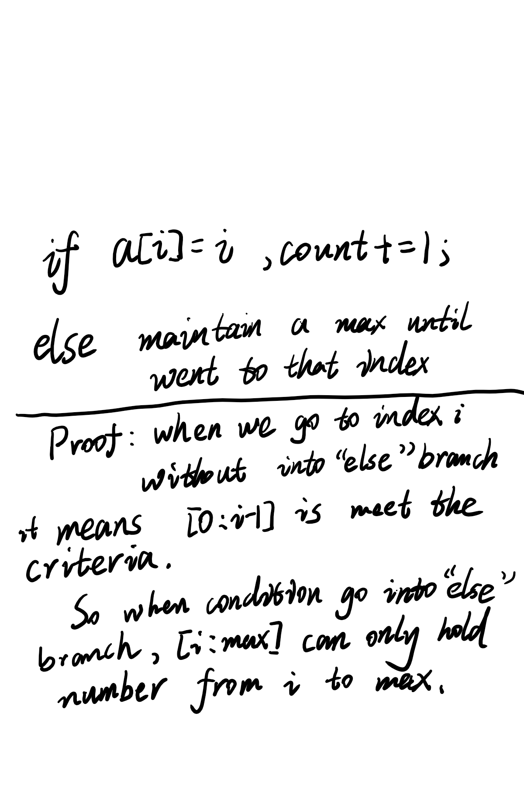
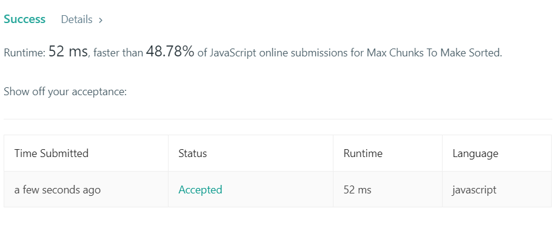
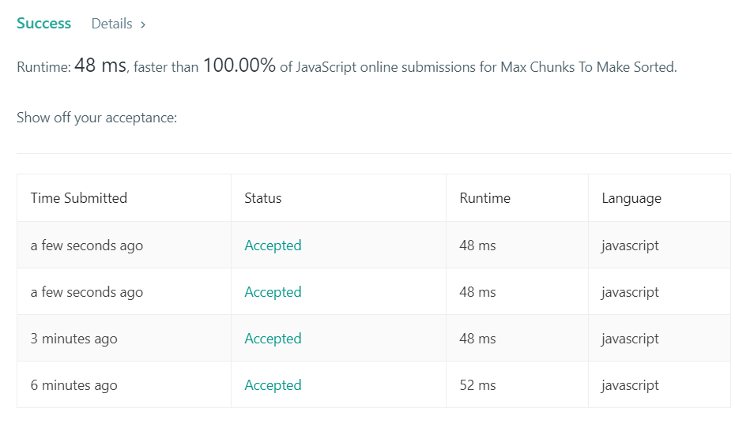

+++
title = "2018-12-21 Daily Challenge"
path = "2018-12-21-daily-challenge"
date = 2018-12-21T00:00:46+00:00
updated = 2020-09-19T20:01:27.624335+00:00
description = "Daily Challenge"
in_search_index = true

[taxonomies]
tags = [ "Math", "ProjectEuler", "Division", "Inclusion–exclusionPrinciple", "Algorithm", "LeetCode",]
categories = [ "DailyChallenge",]
archives = [ "archive",]
+++
What I’ve done today is *Multiples of 3 and 5* in *Rust* and *Max Chunks To Make Sorted* in *JavaScript*.

<!-- more -->

# Math

## Problem

```
Multiples of 3 and 5

Problem 1 

If we list all the natural numbers below 10 that are multiples of 3 or 5, we get 3, 5, 6 and 9. The sum of these multiples is 23.

Find the sum of all the multiples of 3 or 5 below 1000.
```

## Solution

One way to do it is brute force method, this range is small enough.

Another way to do it is to come up with a formula which can compute the multiples of a number in constant time, then we should use [Inclusion–exclusion principle](https://en.wikipedia.org/wiki/Inclusion%E2%80%93exclusion_principle) to get the final answer.

I'll show you both ways in Rust.

## Implementation

```rust
use std::io;

fn main() {
    let mut range = String::new();
    io::stdin().read_line(&mut range)
        .expect("Failed to read line");

    let range: i32 = match range.trim().parse(){
        Ok(num) => num,
        Err(_) => 0,
    };

    println!("{}", multiples_of_3_and_5(range - 1));
    println!("{}", multiples_of_3_and_5_brute(range - 1));
}

fn multiples_of_a_number(n: i32, d: i32) -> i32 {
    (n / d * d + d) * (n / d) / 2
}

fn multiples_of_3_and_5(n: i32) -> i32 {
    multiples_of_a_number(n, 3) + multiples_of_a_number(n, 5) - multiples_of_a_number(n, 15)
}

fn multiples_of_3_and_5_brute(n: i32) -> i32 {
    let mut ans = 0;
    for x in 1..n+1 {
        if x%3 == 0 || x%5==0 {
            ans += x;
        }
    }
    ans
}
```

# Algorithm

## Problem

```
769. Max Chunks To Make Sorted

Given an array arr that is a permutation of [0, 1, ..., arr.length - 1], we split the array into some number of "chunks" (partitions), and individually sort each chunk.  After concatenating them, the result equals the sorted array.

What is the most number of chunks we could have made?

Example 1:

Input: arr = [4,3,2,1,0]
Output: 1
Explanation:
Splitting into two or more chunks will not return the required result.
For example, splitting into [4, 3], [2, 1, 0] will result in [3, 4, 0, 1, 2], which isn't sorted.
Example 2:

Input: arr = [1,0,2,3,4]
Output: 4
Explanation:
We can split into two chunks, such as [1, 0], [2, 3, 4].
However, splitting into [1, 0], [2], [3], [4] is the highest number of chunks possible.
Note:

arr will have length in range [1, 10].
arr[i] will be a permutation of [0, 1, ..., arr.length - 1].
```

## Solution



## Implementation

I come up with an awkward implication:

```javascript
/**
 * @param {number[]} arr
 * @return {number}
 */
var maxChunksToSorted = (arr) => {
  let count = 0;
  let mx;
  let el = false;
  for(const [index, value] of arr.entries()){
    if(!el && index == value) count += 1;
    else if (!el) {
      el = true;
      mx = value;
    }else if (value > mx){
      mx = value;
    }else if(mx == index){
      count +=1;
      el = false;
    }
  }
  return count;
};
```

And got 1A.



I'm very happy but when I check the solution page I find a more elegant implication.

When there is a maintained max indicate the situation, there is no way find a index equal max, but the range \[i: max\] doesn't meet the criteria.

So I improved my implication and beat 100% online submissions, what a cheerful thing!!!

```javascript
/**
 * @param {number[]} arr
 * @return {number}
 */
var maxChunksToSorted = (arr) => {
  let count = 0;
  let mx = -1;
  for(const [index, value] of arr.entries()){
    mx = (mx > value)? mx : value;
    if(mx == index) ++count;
  }
  return count;
};
```

