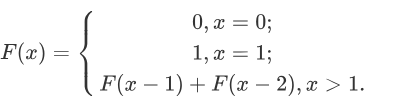
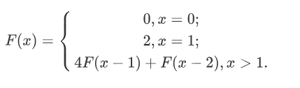

+++
title = "2018-12-22 Daily Challenge"
path = "2018-12-22-daily-challenge"
date = 2018-12-22T01:04:40+00:00
updated = 2020-09-19T20:01:27.624335+00:00
description = "DailyChallenge"
in_search_index = true

[taxonomies]
tags = [ "Math", "ProjectEuler", "Fibonacci", "Algorithm", "LeetCode",]
categories = [ "DailyChallenge",]
archives = [ "archive",]
+++
What I've done today is *Even Fibonacci numbers* in *Rust* and *K-th Smallest Prime Fraction* in *cpp*.

<!-- more -->

# Math

## Problem

```
Even Fibonacci numbers

Problem 2 

Each new term in the Fibonacci sequence is generated by adding the previous two terms. By starting with 1 and 2, the first 10 terms will be:

1, 2, 3, 5, 8, 13, 21, 34, 55, 89, ...

By considering the terms in the Fibonacci sequence whose values do not exceed four million, find the sum of the even-valued terms.
```

## Solution

Of course we can use brute force, the range is still small enough to do it in one second.

But if we focus on Fibonacci sequence and its beautiful property, we can find more.

Let's think about Fibonacci sequence start from index 0 and value 0, which means

$$F(x)=\left\{\begin{matrix} 0,x=0;\\1,x=1;\\F(x-1)+F(x-2),x>1.\end{matrix}\right.$$



And if you're familiar with it, you must know the quickest way to compute Xth numbers is to use quick matrix exponentiation algorithm, which only need asymptotically  $O(xlogx)$.

And look at the even-valued term, what we can find is ...

**0**, 1, 1, **2**, 3, 5, **8**, 13...

Emmmmmmmmm, their indices is multiples of 3.

We should've known it, shouldn't we?

Because odd add odd is even, odd add even is odd, so pattern goes like

even, odd, odd, even, odd, odd...

And if we can find something when we delve into it? Like if we can use only even-valued term to compute next one? Let's try it.

$$F_x =  F_{x-1} + F_{x-2}=2F_{x-2} + F_{x-3} = 3F_{x-3}+2F_{x-4}$$

$$=3F_{x-3}+(F_{x-4}+F_{x-5})+F_{x-6}=4F_{x-3}+F_{x-6}$$

Which means we could treat our new sequence as a new sequence and its value is

$$F(x)=\left\{\begin{matrix} 0,x=0;\\2,x=1;\\4F(x-1)+F(x-2),x>1.\end{matrix}\right.$$



Also we can compute it with quick matrix exponentiation algorithm.

Yes, we did it. So we just need to implicate it!

---

Sadly saying that I find num_bigint crate is much slower than Python original computation...

And secondly I find that I'm not capable to write a quick matrix exponentiation in Rust...

Leave them alone until I can do it...

## Implementation

```rust
extern crate num_bigint;
extern crate num_traits;

use num_bigint::{BigUint};
use num_traits::{Zero};
use std::mem::replace;

fn main() {
    println!("Used for don't need to delete it...{}", fib(2));
    println!("Used for don't need to delete it...{}", fibonacci_recursive(2));
    let mut x0: u64 = 0;
    let mut x1: u64 = 2;
    let mut x2: u64;
    let mut sum: u64 = 0;
    while x1 <= 4000000 {
        x2 = x0 + 4*x1;
        x0 = x1;
        x1 = x2;
        sum += x0;
    }
    println!("The answer is {}", sum);
}

// Implication using bigint, but its so slow...
fn fib(n: usize) -> BigUint {
    let mut f0: BigUint = Zero::zero();
    let mut f1: BigUint = BigUint::parse_bytes(b"2", 10).unwrap();
    let four: BigUint = BigUint::parse_bytes(b"4", 10).unwrap();
    let mut f2: BigUint;
    for _ in 0..n {
        f2 = f0 + &four * &f1;
        // This is a low cost way of swapping f0 with f1 and f1 with f2.
        f0 = replace(&mut f1, f2);
    }
    f0
}

fn fibonacci_recursive(n: u64) -> u64 {
    let mut x0: u64 = 0;
    let mut x1: u64 = 1;
    for _ in 0..n{
        x1 = x0 + x1;
        x0 = x1 - x0;
    }
    x0
}

```

# Algorithm

## Problem

```
786. K-th Smallest Prime Fraction

A sorted list A contains 1, plus some number of primes.  Then, for every p < q in the list, we consider the fraction p/q.

What is the K-th smallest fraction considered?  Return your answer as an array of ints, where answer[0] = p and answer[1] = q.

Examples:
Input: A = [1, 2, 3, 5], K = 3
Output: [2, 5]
Explanation:
The fractions to be considered in sorted order are:
1/5, 1/3, 2/5, 1/2, 3/5, 2/3.
The third fraction is 2/5.

Input: A = [1, 7], K = 1
Output: [1, 7]
Note:

A will have length between 2 and 2000.
Each A[i] will be between 1 and 30000.
K will be between 1 and A.length * (A.length - 1) / 2.
```

## Solution

I think that avoiding computation of fractions is impossible. So time complexity is at least $O(n^2)$.

And I remembered algorithm that find k-th element with idea of quick sort.

But I'm wondering if JavaScript is quick enough to get me a AC?

---

OK, when I spent my half day fight with JS and I got a MLE......

Such a depressive experience......

So I change my implication to cpp and use STL

TAT

But I'll upload my JS code, just for……my wasted time.

## Implementation

```javascript
/**
 * @param {number[]} A
 * @param {number} K
 * @return {number[]}
 */
var kthSmallestPrimeFraction = (A, K) => {
  let arr = [];
  let indexarr = [];
  let i = 0;
  for(const value1 of A){
    for(const value2 of A){
      if(value2 == value1) break;
      arr.push([value2/value1, value2, value1]);
      indexarr.push(i);
      i += 1;
    }
  }
  let findkth = (A, bg, ed, K) => {
    let p = partition(A, bg, ed);
    if(p == K-1) return A[p];
    else if(p < K-1) return findkth(A, p+1, ed, K);
    else return findkth(A, bg, p-1, K);
  };
  let partition = (A, bg, ed) => {
    let pivot = arr[A[bg]];
    let i = bg + 1;
    let j = ed;
    while(true){
      while(arr[A[i]] < pivot && i <= ed) ++i;
      while(arr[A[j]] > pivot && j > bg) --j;
      if(i > j) break;
      [A[i], A[j]] = [A[j], A[i]];
      ++i;
      --j;
    }
    [A[bg], A[j]] = [A[j], A[bg]];
    return j;
  };
  // console.log(indexarr);
  // console.log(arr);
  // console.log(i);
  let a = findkth(indexarr,0,i-1,K);
  // console.log(arr[a]);
  return [arr[a][1], arr[a][2]];
};

// console.log(kthSmallestPrimeFraction([1,2,3,5],3));
// console.log(kthSmallestPrimeFraction([1,7],1));
```

```cpp
struct s {
    double val;
    int up;
    int dn;

    bool operator < (const s & b) {
        return val < b.val;
    }
}v[2000000];
class Solution {
    public:
        vector < int > kthSmallestPrimeFraction(vector < int > & A, int K) {

            vector < int > ans;
            int cnt = 0;
            for (int i = 1; i < A.size(); ++i) {
                for (int j = 0; j < i; ++j) {
                    v[cnt].val = 1.0 * A[j] / A[i];
                    v[cnt].up = A[j];
                    v[cnt].dn = A[i];
                    ++cnt;
                }
            }
            nth_element(v, v + K - 1, v + cnt);
            // for(int i=0;i<v.size();++i){
            //     cout<<v[i].up<<" "<<v[i].dn<<endl;
            // }
            ans.push_back(v[K - 1].up);
            ans.push_back(v[K - 1].dn);
            return ans;
        }
};
```