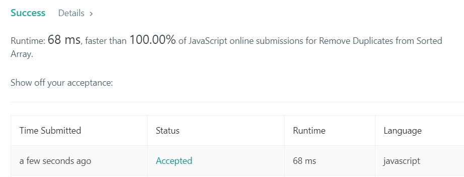

+++
title = "2018-12-24 Daily Challenge"
path = "2018-12-24-daily-challenge"
date = 2018-12-24T09:23:29+00:00
updated = 2020-09-19T20:01:27.624335+00:00
description = "DailyChallenge"
in_search_index = true

[taxonomies]
tags = [ "Math", "ProjectEuler", "Algorithm", "LeetCode",]
categories = [ "DailyChallenge",]
archives = [ "archive",]
+++
What I've done today is *Largest palindrome product* in *Rust* and *Remove Duplicates from Sorted Array* in *JavaScript*.

<!--more-->

# Math

## Problem

```
Largest palindrome product

Problem 4 

A palindromic number reads the same both ways. The largest palindrome made from the product of two 2-digit numbers is 9009 = 91 × 99.

Find the largest palindrome made from the product of two 3-digit numbers.
```

## Solution

I can't come up with a more gentle solution than brute force.

---

Even that I find I can do some optimization on it.

But when check the overview I find something new. Just check my code~

## Implementation

```Rust
// My original solution
fn main() {
    let mut num: i32;
    let mut num_s: String;
    let mut ok: bool;
    let mut ans: i32 = 0;
    for i in 100..999 {
        for j in (i..999).rev() {
            num = i * j;
            if ans > num{
                break;
            }
            num_s = num.to_string();
            ok = true;
            for k in 0..num_s.len()/2{
                if num_s.as_bytes()[k] != num_s.as_bytes()[num_s.len()-k-1]{
                    ok = false;
                }
            }
            if ok{
                ans = num;
                println!("{} * {} = {}", i, j, num);
            }
        }
    }
    println!("Answer is {}", ans);
}

// Optimized solution
fn main() {
    let mut num: i32;
    let mut num_s: String;
    let mut ok: bool;
    let mut step: i32;
    let mut j: i32;
    let mut ans: i32 = 0;
    for i in 100..999 {
        if i % 11 == 0 {
            step = -1;
            j = 999;
        }else {
            step = -11;
            j = 990;
        }
        while j > 100 {
            num = i * j;
            if ans > num{
                break;
            }
            num_s = num.to_string();
            ok = true;
            for k in 0..num_s.len()/2{
                if num_s.as_bytes()[k] != num_s.as_bytes()[num_s.len()-k-1]{
                    ok = false;
                }
            }
            if ok{
                ans = num;
                println!("{} * {} = {}", i, j, num);
            }
            j += step;
        }
    }
    println!("Answer is {}", ans);
}
```

# Algorithm

## Problem

```
26. Remove Duplicates from Sorted Array

Given a sorted array nums, remove the duplicates in-place such that each element appear only once and return the new length.

Do not allocate extra space for another array, you must do this by modifying the input array in-place with O(1) extra memory.

Example 1:

Given nums = [1,1,2],

Your function should return length = 2, with the first two elements of nums being 1 and 2 respectively.

It doesn't matter what you leave beyond the returned length.
Example 2:

Given nums = [0,0,1,1,1,2,2,3,3,4],

Your function should return length = 5, with the first five elements of nums being modified to 0, 1, 2, 3, and 4 respectively.

It doesn't matter what values are set beyond the returned length.
Clarification:

Confused why the returned value is an integer but your answer is an array?

Note that the input array is passed in by reference, which means modification to the input array will be known to the caller as well.
```

## Solution

Just use two pointer/indice to deal it~

---

I write an implication that move duplicated element to the end, but find that it's said "remove"~So I rewrite it.

## Implementation

```javascript
/**
 * @param {number[]} nums
 * @return {number}
 */
var moveDuplicates = (nums = []) => {
  let len = nums.length;
  if(len == 1) return 1;
  let rp = 1;
  let lp = 0;
  while(rp < len){
    while(rp < len && nums[lp] == nums[rp]) ++rp;
    if(rp < len && rp != lp+1){
      [nums[lp+1], nums[rp]] = [nums[rp], nums[lp+1]];
    }
    if(nums[lp] < nums[lp+1]) ++lp;
    ++rp
  }
  return lp+1;
};

/**
 * @param {number[]} nums
 * @return {number}
 */
var removeDuplicates = (nums = []) => {
  let len = nums.length;
  if(len < 2) return len;
  let rp = 1;
  let lp = 0;
  while(rp < len){
    if(nums[rp] != nums[lp]){
      ++lp;
      nums[lp] = nums[rp];
    }
    ++rp;
  }
  return lp+1;
};

let nums = [1,1,2];
console.log(removeDuplicates(nums));
console.log(nums);

nums = [0,0,1,1,1,2,2,3,3,4];
console.log(removeDuplicates(nums));
console.log(nums);

nums = [0,0,1,1,1,2,2,3,3,4,4,4];
console.log(removeDuplicates(nums));
console.log(nums);

nums = [0,0];
console.log(removeDuplicates(nums));
console.log(nums);

nums = [1,2];
console.log(removeDuplicates(nums));
console.log(nums);
```

