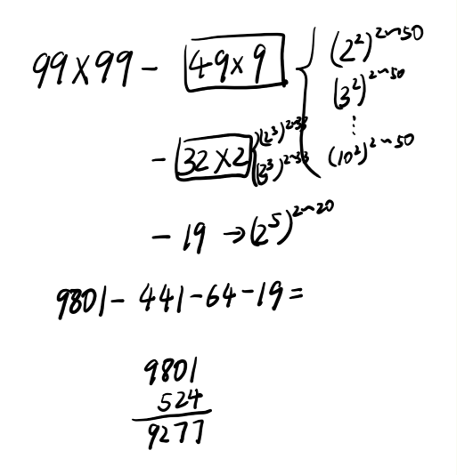

+++
title = "2019-01-18 Daily Challenge"
path = "2019-01-18-daily-challenge"
date = 2019-01-18T01:22:10+00:00
updated = 2020-09-19T20:01:27.626330+00:00
description = "DailyChallenge"
in_search_index = true

[taxonomies]
tags = [ "Math", "ProjectEuler", "Algorithm", "LeetCode",]
categories = [ "DailyChallenge",]
archives = [ "archive",]
+++
What I've done today is *Distinct powers* in ~~*Oral Calculation*~~*Rust* and *To Lower Case* in *JavaScript*.

<!--more-->

# Math

## Problem

### Distinct powers

### Problem 29

Consider all integer combinations of $a^b$ for 2 ≤ *a* ≤ 5 and 2 ≤ *b* ≤ 5:

$$2^2=4,2^3=8,2^4=16,2^5=32$$

$$3^2=9,3^3=27,3^4=81,3^5=243$$

$$2^2=4,2^3=8,2^4=16,2^5=32$$

$$2^2=4,2^3=8,2^4=16,2^5=32$$

If they are then placed in ppowewernumerical order, with any repeats removed, we get the following sequence of 15 distinct terms:

4, 8, 9, 16, 25, 27, 32, 64, 81, 125, 243, 256, 625, 1024, 3125

How many distinct terms are in the sequence generated by $a^b$ for 2 ≤ *a* ≤ 100 and 2 ≤ *b* ≤ 100?

## Solution

I'll do it with inclusion-exclusion principle.

Powers of two which under 101 are 4, 8, 16, 32, 64.

Powers of three which under 101 are 9, 27, 81.

Powers of four which under 101 are 16, 64.

Powers of five which under 101 is 25.

Powers of six which under 101 is 36.

Powers of seven which under 101 is 49.

Powers of eight which under 101 is 64.

Powers of nine which under 101 is 81.

Powers of ten  which under 101 is 100.

Answer is

 $$|powers\ of\ 2|+|powers\ of\ 3|+...+|powers\ of\ 100|-$$

$$|powers\ of\ 2\ and\ 4|-..-|powers\ of\ 10\ and\ 100|+$$

$$|powers\ of\ 2,4,16|+|powers\ of\ 3,9,81|-|powers\ of\ 2,4,8,64|$$

And I come up with this draft on plane



And yes! Get the wrong answer XD

I check my thoughts and found I miss a lot of thing. So I decide to do it with brute force :p

Code to check my id:

```python
s = set()
for i in range(2, 101):
    l = len(s)
    for j in range(2, 101):
        s.add(i**j)
    print(i,len(s)-l)
```

Result:

```
2 99  
3 99  
4 50  
5 99  
6 99  
7 99  
8 50  
9 50  
10 99 
11 99 
12 99 
13 99 
14 99 
15 99 
16 41 
17 99 
18 99 
19 99 
20 99 
21 99 
22 99 
23 99 
24 99 
25 50 
26 99 
27 50 
28 99 
29 99 
30 99 
31 99 
32 51 
33 99 
34 99 
35 99 
36 50 
37 99 
38 99 
39 99 
40 99 
41 99 
42 99 
43 99 
44 99 
45 99 
46 99 
47 99 
48 99 
49 50 
50 99 
51 99 
52 99 
53 99 
54 99 
55 99 
56 99 
57 99 
58 99 
59 99 
60 99 
61 99 
62 99 
63 99 
64 37 
65 99 
66 99 
67 99 
68 99 
69 99 
70 99 
71 99 
72 99 
73 99 
74 99 
75 99 
76 99 
77 99 
78 99 
79 99 
80 99 
81 41 
82 99 
83 99 
84 99 
85 99 
86 99 
87 99 
88 99 
89 99 
90 99 
91 99 
92 99 
93 99 
94 99 
95 99 
96 99 
97 99 
98 99 
99 99 
100 50
```


## Implementation

```rust
extern crate num_bigint;
extern crate num_traits;

use num_bigint::BigInt;
use num_traits::pow;
use std::collections::HashSet;

fn main() {
    let mut set = HashSet::new();
    for i in 2..101 {
        for j in 2..101 {
            let base = BigInt::from(i);
            set.insert(pow(base,j));
        }
    }
    println!("Answer is {}", set.len());
}

```


# Algorithm

## Problem

### 709. To Lower Case

Implement function ToLowerCase() that has a string parameter str, and returns the same string in lowercase.

 

**Example 1:**

```
Input: "Hello"
Output: "hello"
```

**Example 2:**

```
Input: "here"
Output: "here"
```

**Example 3:**

```
Input: "LOVELY"
Output: "lovely"
```


## Solution

Nothing to say.

## Implementation

```js
/**
 * @param {string} str
 * @return {string}
 */
var toLowerCase = function(str) {
  return str.toLowerCase();
};
```