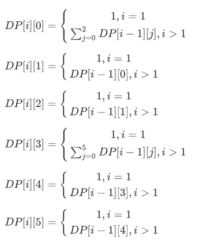

+++
title = "2019-01-26 Daily Challenge"
path = "2019-01-26-daily-challenge"
date = 2019-01-26T00:08:13+00:00
updated = 2020-09-19T20:01:27.629322+00:00
description = "DailyChallenge"
in_search_index = true

[taxonomies]
tags = [ "Math", "ProjectEuler", "Algorithm", "LeetCode",]
categories = [ "DailyChallenge",]
archives = [ "archive",]
+++
What I've done today is *Truncatable primes* in *Rust* and *Student Attendance Record II* in *JavaScript*.

<!--more-->

# Math

## Problem

### Truncatable primes

### Problem 37

The number 3797 has an interesting property. Being prime itself, it is possible to continuously remove digits from left to right, and remain prime at each stage: 3797, 797, 97, and 7. Similarly we can work from right to left: 3797, 379, 37, and 3.

Find the sum of the only eleven primes that are both truncatable from left to right and right to left.

NOTE: 2, 3, 5, and 7 are not considered to be truncatable primes.

## Solution

Nothing to say.

## Implementation

```rust
extern crate primal;

use primal::Sieve;

fn main() {
    const LIMIT: usize = 1_000_000_000;
    let sieve: Sieve = Sieve::new(LIMIT);
    let mut ans = 0;
    let mut cnt = 0;
    let mut i = 1;
    while cnt < 11 {
        let tmp = sieve.nth_prime(i);
        if is_truncatable(tmp, &sieve) {
            ans += tmp;
            cnt += 1;
            println!("{}", tmp)
        }
        i += 1;
    }
    println!("Answer is {}", ans);
}

fn is_truncatable(n: usize, sieve: &Sieve) -> bool {
    let l = n.to_string().len();
    if l == 1 {
        return false;
    }
    let mut base = 10usize.pow(l as u32 - 1);
    while base != 1 {
        // println!("{}",n%base);
        if !sieve.is_prime(n % base) {
            return false
        }
        base /= 10;
    }
    let mut n = n;
    while n != 0 {
        // println!("{}",n);
        if !sieve.is_prime(n) {
            return false;
        }
        n /= 10;
    }
    true
}
```

# Algorithm

## Problem

### 552. Student Attendance Record II

Given a positive integer **n**, return the number of all possible attendance records with length n, which will be regarded as rewardable. The answer may be very large, return it after mod 109 + 7.

A student attendance record is a string that only contains the following three characters:


1. **'A'** : Absent.
2. **'L'** : Late.
3. **'P'** : Present.


A record is regarded as rewardable if it doesn't contain **more than one 'A' (absent)** or **more than two continuous 'L' (late)**.

**Example 1:**

```
Input: n = 2
Output: 8 
Explanation:
There are 8 records with length 2 will be regarded as rewardable:
"PP" , "AP", "PA", "LP", "PL", "AL", "LA", "LL"
Only "AA" won't be regarded as rewardable owing to more than one absent times. 
```


**Note:** The value of **n** won't exceed 100,000.

## Solution

There is a DP problem.

Let set a array $DP[n][6]$，where：

$$DP[n][0]$$ means no Absent and no Late **at  last of record**,

$$DP[n][1]$$ means no Absent and one Late **at  last of record**,

$$DP[n][2]$$ means no Absent and two Late **at  last of record**,

$$DP[n][3]$$ means one Absent and no Late **at  last of record**,

$$DP[n][4]$$ means one Absent and one **at  last of record**,

$$DP[n][5]$$ means one Absent and two **at  last of record**,

so,



$$DP[i][0] = \left\{\begin{matrix} 1,i=1\\\sum_{j=0}^2DP[i-1][j],i>1\end{matrix}\right.​$$

$$DP[i][1] = \left\{\begin{matrix} 1,i=1\\DP[i-1][0],i>1\end{matrix}\right.​$$

$$DP[i][2] = \left\{\begin{matrix} 1,i=1\\DP[i-1][1],i>1\end{matrix}\right.​$$

$$DP[i][3] = \left\{\begin{matrix} 1,i=1\\\sum_{j=0}^5DP[i-1][j],i>1\end{matrix}\right.$$

$$DP[i][4] = \left\{\begin{matrix} 1,i=1\\DP[i-1][3],i>1\end{matrix}\right.$$

$$DP[i][5] = \left\{\begin{matrix} 1,i=1\\DP[i-1][4],i>1\end{matrix}\right.​$$

## Implementation

```js
/**
 * @param {number} n
 * @return {number}
 */
var checkRecord = function(n) {
  const MOD = 1000000007;
  let dp = [];
  dp.push([1, 1, 0, 1, 0, 0]);
  dp.push([0, 0, 0, 0, 0, 0]);
  for (let i = 1; i < n; ++i) {
    dp[i & 1][0] = (dp[(~i) & 1][0] + dp[(~i) & 1][1]) % MOD;
    dp[i & 1][0] = (dp[i & 1][0] + dp[(~i) & 1][2]) % MOD;
    dp[i & 1][1] = dp[(~i) & 1][0];
    dp[i & 1][2] = dp[(~i) & 1][1];
    dp[i & 1][3] = 0;
    for (let j = 0; j < 6; ++j) {
      dp[i & 1][3] += dp[(~i) & 1][j];
      dp[i & 1][3] %= MOD;
    }
    dp[i & 1][4] = dp[(~i) & 1][3];
    dp[i & 1][5] = dp[(~i) & 1][4];
  }
  let ans = 0;
  for (let i = 0; i < 6; ++i) {
    ans += dp[(~n) & 1][i];
    ans %= MOD;
  }
  return ans;
};
```