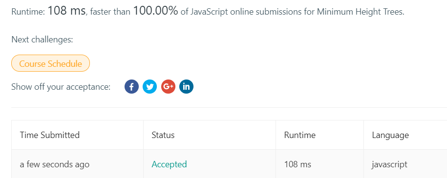

+++
title = "2019-01-31 Daily Challenge"
path = "2019-01-31-daily-challenge"
date = 2019-01-31T00:10:20+00:00
updated = 2020-09-19T20:01:27.628325+00:00
description = "DailyChallenge"

[taxonomies]
tags = [ "Math", "ProjectEuler", "Algorithm", "LeetCode",]
categories = [ "DailyChallenge",]
archives = [ "archive",]
+++
What I've done today is *Coded triangle numbers* in *Rust* and *Minimum Height Trees* in *JavaScript*.

<!-- more -->

# Math

## Problem

### Coded triangle numbers

### Problem 42

The *n*th term of the sequence of triangle numbers is given by, *tn* = ½*n*(*n*+1); so the first ten triangle numbers are:

1, 3, 6, 10, 15, 21, 28, 36, 45, 55, ...

By converting each letter in a word to a number corresponding to its alphabetical position and adding these values we form a word value. For example, the word value for SKY is 19 + 11 + 25 = 55 = *t*10. If the word value is a triangle number then we shall call the word a triangle word.

Using [words.txt](https://projecteuler.net/project/resources/p042_words.txt) (right click and 'Save Link/Target As...'), a 16K text file containing nearly two-thousand common English words, how many are triangle words?

## Solution

Nothing to say.

## Implementation

```rust
use std::collections::HashSet;

fn main() {
    let words = ["A", "ABILITY", "ABLE", "ABOUT", "ABOVE", "ABSENCE", "ABSOLUTELY", "ACADEMIC",
"ACCEPT", "ACCESS", "ACCIDENT", "ACCOMPANY", "ACCORDING", "ACCOUNT", "ACHIEVE", "ACHIEVEMENT",
/* ... */
"YEAH", "YEAR", "YES", "YESTERDAY", "YET", "YOU", "YOUNG", "YOUR",
"YOURSELF", "YOUTH"];
    let mut set = HashSet::new();
    let mut ans = HashSet::new();
    const OFFSET: usize = 'A' as usize - 1;
    for i in 1..20 {
        set.insert(i*(i+1)/2);
    }
    for word in words.iter() {
        let mut tmp = 0;
        for c in word.chars() {
            tmp += (c as usize) - OFFSET;
        }
        if set.contains(&tmp) {
            ans.insert(word);
        }
    }
    println!("Answer is {}", ans.len());
}
```

# Algorithm

## Problem

### 310. Minimum Height Trees

Medium

For an undirected graph with tree characteristics, we can choose any node as the root. The result graph is then a rooted tree. Among all possible rooted trees, those with minimum height are called minimum height trees (MHTs). Given such a graph, write a function to find all the MHTs and return a list of their root labels.

**Format**
The graph contains `n` nodes which are labeled from `0` to `n - 1`. You will be given the number `n` and a list of undirected `edges`(each edge is a pair of labels).

You can assume that no duplicate edges will appear in `edges`. Since all edges are undirected, `[0, 1]` is the same as `[1, 0]`and thus will not appear together in `edges`.

**Example 1 :**

```
Input: n = 4, edges = [[1, 0], [1, 2], [1, 3]]

        0
        |
        1
       / \
      2   3 

Output: [1]
```

**Example 2 :**

```
Input: n = 6, edges = [[0, 3], [1, 3], [2, 3], [4, 3], [5, 4]]

     0  1  2
      \ | /
        3
        |
        4
        |
        5 

Output: [3, 4]
```

**Note**:

- According to the [definition of tree on Wikipedia](https://en.wikipedia.org/wiki/Tree_(graph_theory)): “a tree is an undirected graph in which any two vertices are connected by *exactly* one path. In other words, any connected graph without simple cycles is a tree.”
- The height of a rooted tree is the number of edges on the longest downward path between the root and a leaf.

## Solution

Image that if we take all leaf nodes, then the tree will be smaller, and there comes new leaf nodes, over and over again, until all nodes can be leaves, then there are our roots.

Use topological sort can solve it.

## Implementation

```js
/**
 * @param {number} n
 * @param {number[][]} edges
 * @return {number[]}
 */
var findMinHeightTrees = function(n, edges) {
  if (n === 1) return [0];
  let G = [];
  let degree = new Array(n).fill(0);
  for (let i = 0; i < n; ++i) {
    G.push([]);
  }
  for (const edge of edges) {
    G[edge[0]].push(edge[1]);
    G[edge[1]].push(edge[0]);
    ++degree[edge[0]];
    ++degree[edge[1]];
  }
  let queue = [];
  let rmcnt = 0;
  for (let i = 0; i < n; ++i) {
    if (degree[i] === 1) {
      queue.push(i);
      ++rmcnt;
    }
  }
  while (rmcnt < n) {
    let cnt = queue.length;
    while (cnt) {
      --cnt;
      let cur = queue.shift();
      for (const i of G[cur]) {
        --degree[i];
        if (degree[i] === 1) {
          queue.push(i);
          ++rmcnt;
        }
      }
    }
  }
  return queue;
};
```

