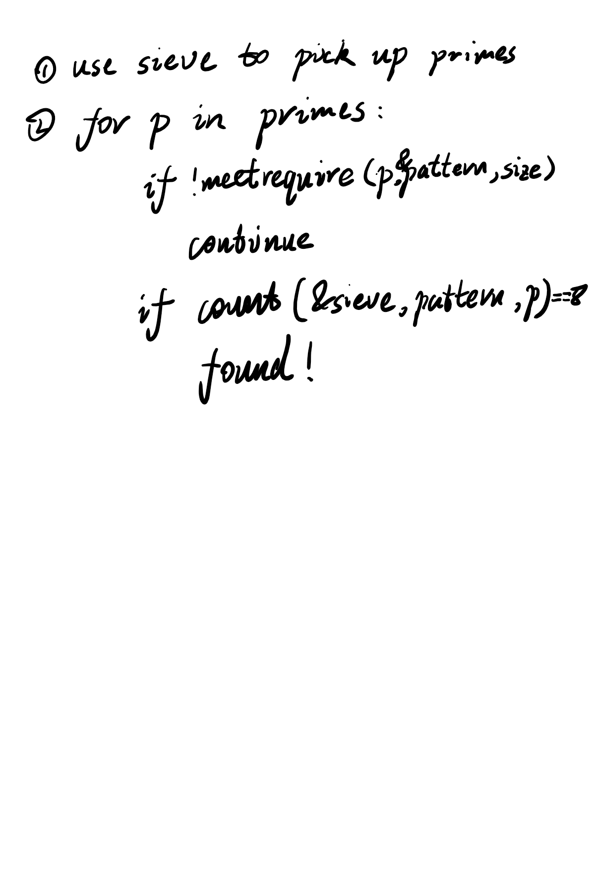
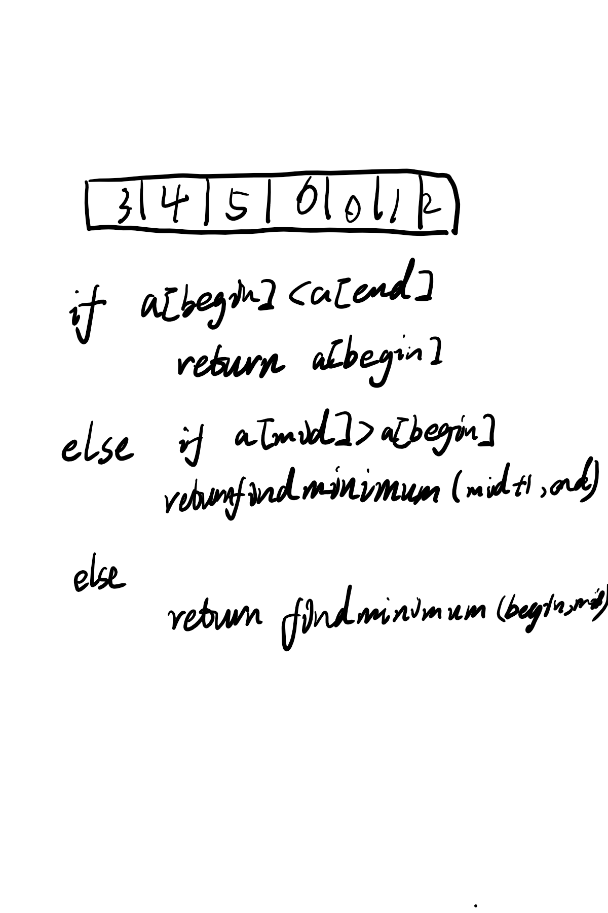

+++
title = "2019-02-09 Daily Challenge"
path = "2019-02-09-daily-challenge"
date = 2019-02-09T17:45:05+00:00
updated = 2020-09-19T20:01:27.628325+00:00
description = "DailyChallenge"
in_search_index = true

[taxonomies]
tags = [ "Math", "ProjectEuler", "Algorithm", "LeetCode",]
categories = [ "DailyChallenge",]
archives = [ "archive",]
+++
What I've done today is *Prime digit replacements* in *Rust* and *Find Minimum in Rotated Sorted Array* in *JavaScript*.

<!-- more -->

# Math

## Problem

### Prime digit replacements

### Problem 51

By replacing the 1st digit of the 2-digit number \*3, it turns out that six of the nine possible values: 13, 23, 43, 53, 73, and 83, are all prime.

By replacing the 3rd and 4th digits of 56\*\*3 with the same digit, this 5-digit number is the first example having seven primes among the ten generated numbers, yielding the family: 56003, 56113, 56333, 56443, 56663, 56773, and 56993. Consequently 56003, being the first member of this family, is the smallest prime with this property.

Find the smallest prime which, by replacing part of the number (not necessarily adjacent digits) with the same digit, is part of an eight prime value family.

## Solution

I've read description several times and realize it's a very interesting problem.

First you need to find prime match the patter "have 3 digit with same value", why is 3? Actually it will be any number that is multiple of 3.

There is a little trick we learn at junior school: every number which can be divide by 3, the sum of their digits can be divide by 3, and vice versa.

Second there is a trick to find set $S$'s(of size $n$) subset $R$ which is of size $r$:

```c
for (int s = (1<<r)-1; s<(1<<n); ) {
    int x = s&-s;
    int y = s+x;
    s = ((s&-y)/x>>1) | y;
}
```

Here's my idea:



There is still something I can do to improve program's performance.

But just leave it XD

## Implementation

```rust
extern crate primal;

use primal::Sieve;

fn main() {
    let sieve: Sieve = Sieve::new(1_000_000_000);
    let mut up_bound: usize = 99_999;
    let mut down_bound: usize = 10_000;
    let mut size: usize = 5;
    let mut pattern: isize = -1;
    let mut found: bool = false;
    let mut ans: usize = 0;
    while !found {
        let up_bd = sieve.prime_pi(up_bound) + 1;
        let dw_bd = sieve.prime_pi(down_bound) + 1;
        // println!("{}", up_bound);
        for i in dw_bd..up_bd {
            let p = sieve.nth_prime(i);
            if !match_pattern(p, &mut pattern, size) {
                continue;
            }
            // println!("{}, {:b}", p, pattern);
            if count(p, pattern, size, &sieve) == 8 {
                ans = p;
                found = true;
                break;
            }
        }
        up_bound = up_bound * 10 + 9;
        down_bound *= 10;
        size += 1;
    }
    println!("Answer is {}", ans)
}

fn match_pattern(p: usize, pattern: &mut isize, size: usize) -> bool {
    let mut s: isize = (1 << 3) - 1;
    while s < (1 << size) {
        let mut num = 99;
        let mut cnt = 0;
        let mut tmp_mask = s;
        let mut tmp_p = p;
        while tmp_mask != 0 {
            if tmp_mask & 1 == 1 {
				if num == 99 || num == tmp_p%10 {
					num = tmp_p % 10;
                    cnt += 1;
				} else if num != tmp_p % 10 {
					cnt = -1;
					break;
				}
            }
            tmp_mask >>= 1;
            tmp_p /= 10;
        }
        if cnt == 3 && num < 3 {
            *pattern = s;
            return true;
        }
        let x = s & -s;
        let y = s + x;
        s = ((s & !y) / x >> 1) | y;
    }
    return false;
}

fn count(p: usize, pattern: isize, size: usize, sieve: &Sieve) -> usize {
    let mut cnt: usize = 0;
    let dw_bd = if (pattern << 1) > (1 << size) { 1 } else { 0 };
    for i in dw_bd..10 {
        let mut size = size;
        let mut num = 0;
        let mut tmp_mask = pattern;
        let mut tmp_p = p;
        let mut bcnt = 0;
        while size != 0 {
            if tmp_mask & 1 == 1 {
                num += i * 10usize.pow(bcnt);
            } else {
                num += tmp_p % 10 * 10usize.pow(bcnt);
            }
            tmp_mask >>= 1;
            tmp_p /= 10;
            bcnt += 1;
            size -= 1;
        }
        if sieve.is_prime(num) {
            cnt += 1
        }
    }
    return cnt;
}
```

# Algorithm

## Problem

### 153. Find Minimum in Rotated Sorted Array

Suppose an array sorted in ascending order is rotated at some pivot unknown to you beforehand.

(i.e.,  `[0,1,2,4,5,6,7]` might become  `[4,5,6,7,0,1,2]`).

Find the minimum element.

You may assume no duplicate exists in the array.

**Example 1:**

```
Input: [3,4,5,1,2] 
Output: 1
```

**Example 2:**

```
Input: [4,5,6,7,0,1,2]
Output: 0
```

## Solution

Binary search.



And the solution on the website is not grace.

All binary search with two possible return value(left and right) is b\*\*ls\*\*t.

## Implementation

recursive:

```js
/**
 * @param {number[]} nums
 * @return {number}
 */
var findMin = function(nums) {
  let findmin = (begin, end) => {
    if (nums[begin] <= nums[end]) {
      return nums[begin];
    } else {
      let mid = Math.floor((begin+end)/2);
      if (nums[mid] >= nums[begin]) {
        return findmin(mid+1, end);
      } else {
        return findmin(begin, mid);
      }
    }
  };
  return findmin(0, nums.length-1);
};
```

non-recursive:

```js
/**
 * @param {number[]} nums
 * @return {number}
 */
var findMin = function(nums) {
  let begin = 0, end = nums.length - 1;
  while (nums[begin] > nums[end]) {
    let mid = Math.floor((begin + end) / 2);
    if (nums[mid] >= nums[begin]) {
      begin = mid + 1;
    } else {
      end = mid;
    }
  }
  return nums[begin]; 
};
```