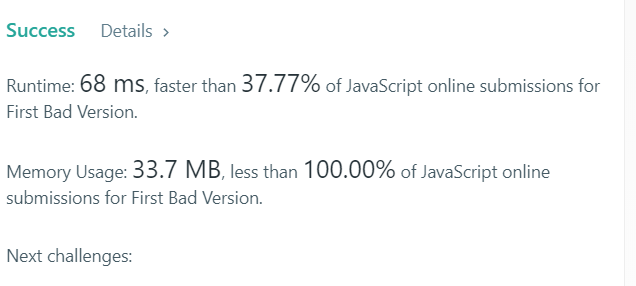

+++
title = "2019-02-16 Daily Challenge"
path = "2019-02-16-daily-challenge"
date = 2019-02-16T00:09:22+00:00
updated = 2020-09-19T20:01:27.631316+00:00
description = "DailyChallenge"
in_search_index = true

[taxonomies]
tags = [ "Math", "ProjectEuler", "Algorithm", "LeetCode",]
categories = [ "DailyChallenge",]
archives = [ "archive",]
+++
What I've done today is *Spiral primes* in *Rust* and *First Bad Version* in *JavaScript*.

<!--more-->

# Math

## Problem

### Spiral primes

### Problem 58

Starting with 1 and spiralling anticlockwise in the following way, a square spiral with side length 7 is formed.

**37** 36 35 34 33 32 **31**
38 **17** 16 15 14 **13** 30
39 18  **5**  4  **3** 12 29
40 19  6  1  2 11 28
41 20  **7**  8  9 10 27
42 21 22 23 24 25 26
**43** 44 45 46 47 48 49

It is interesting to note that the odd squares lie along the bottom right diagonal, 
but what is more interesting is that 8 out of the 13 numbers lying along both 
diagonals are prime; that is, a ratio of 8/13 ≈ 62%.

If one complete new layer is wrapped around the spiral above, a square spiral 
with side length 9 will be formed. If this process is continued, what is the 
side length of the square spiral for which the ratio of primes along both diagonals 
first falls below 10%?

## Solution

Nothing to say.

## Implementation

```rust
extern crate primal;

use primal::Sieve;

fn main() {
    let sieve: Sieve = Sieve::new(1_000_000_000);
    let mut cur: usize = 1;
    let mut spiral: usize = 1;
    let mut prime: usize = 0;
    let bound = 0.1;
    let ans: usize;
    loop {
        let ratio = prime as f64 / (spiral * 4 - 3) as f64;
        println!("{}, {}", spiral, ratio);
        if ratio < bound && spiral != 1 {
            ans = spiral * 2 - 1;
            break;
        }
        for _i in 0..4 {
            cur += spiral * 2;
            if sieve.is_prime(cur) {
                prime += 1;
            }
        }
        spiral += 1;
    }
    println!("Answer is {}", ans);
}
```

# Algorithm

## Problem

### 278. First Bad Version

You are a product manager and currently leading a team to develop a new product. Unfortunately, the latest version of your product fails the quality check. Since each version is developed based on the previous version, all the versions after a bad version are also bad.

Suppose you have `n` versions `[1, 2, ..., n]` and you want to find out the first bad one, which causes all the following ones to be bad.

You are given an API `bool isBadVersion(version)` which will return whether `version` is bad. Implement a function to find the first bad version. You should minimize the number of calls to the API.

**Example:**

```
Given n = 5, and version = 4 is the first bad version.

call isBadVersion(3) -> false
call isBadVersion(5) -> true
call isBadVersion(4) -> true

Then 4 is the first bad version. 
```

## Solution

Simple binary search.

## Implementation

```js
var solution = function(isBadVersion) {
  /**
   * @param {integer} n Total versions
   * @return {integer} The first bad version
   */
  return function(n) {
    let begin = 1;
    let end = n;
    while (begin < end) {
      let mid = Math.floor((begin+end)/2);
      if (isBadVersion(mid)) end = mid;
      else begin = mid + 1;
    }
    return begin;
  };
};
```

;D