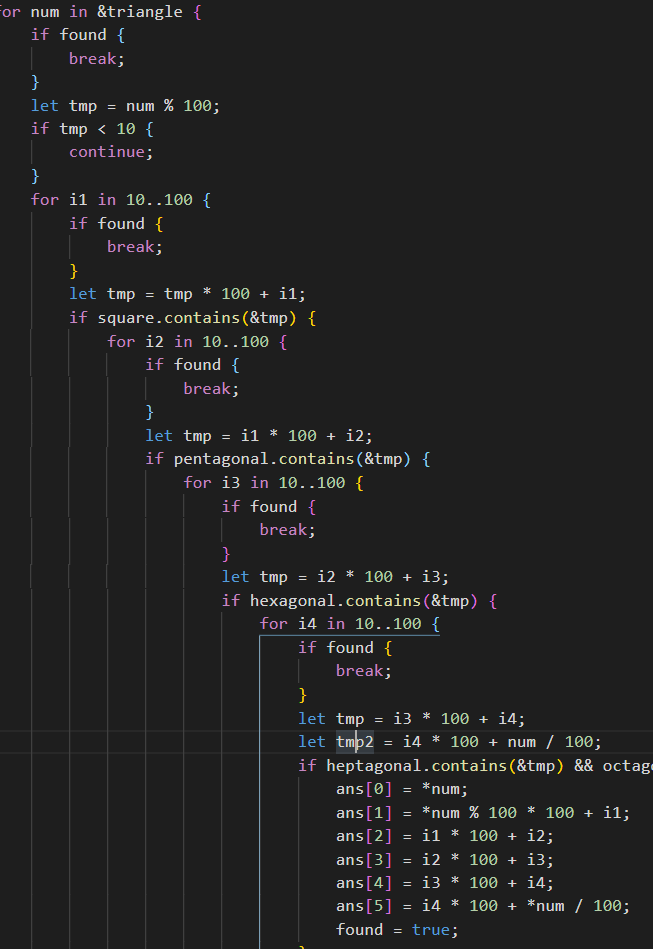

+++
title = "2019-02-19 Daily Challenge"
path = "2019-02-19-daily-challenge"
date = 2019-02-19T10:50:43+00:00
updated = 2020-09-19T20:01:27.631316+00:00
description = "DailyChallenge"

[taxonomies]
tags = [ "Math", "ProjectEuler", "Algorithm", "LeetCode",]
categories = [ "DailyChallenge",]
archives = [ "archive",]
+++
What I've done today is *Cyclical figurate numbers* in *Rust* and *Binary Tree Cameras* in *JavaScript*.

<!-- more -->

# Math

## Problem

### Cyclical figurate numbers

### Problem 61

Triangle, square, pentagonal, hexagonal, heptagonal, and octagonal numbers are all figurate (polygonal) numbers and are generated by the following formulae:

|type|formula|numbers|
| ---------- | -------------------- | --------------------- |
| Triangle         | P3,*n*=*n*(*n*+1)/2        | 1, 3, 6, 10, 15, ...  |
| Square           | P4,*n*=*n*2                | 1, 4, 9, 16, 25, ...  |
| Pentagonal       | P5,*n*=*n*(3*n*−1)/2       | 1, 5, 12, 22, 35, ... |
| Hexagonal        | P6,*n*=*n*(2*n*−1)         | 1, 6, 15, 28, 45, ... |
| Heptagonal       | P7,*n*=*n*(5*n*−3)/2       | 1, 7, 18, 34, 55, ... |
| Octagonal        | P8,*n*=*n*(3*n*−2)         | 1, 8, 21, 40, 65, ... |

The ordered set of three 4-digit numbers: 8128, 2882, 8281, has three interesting properties.

1. The set is cyclic, in that the last two digits of each number is the first two digits of the next number (including the last number with the first).
2. Each polygonal type: triangle (P3,127=8128), square (P4,91=8281), and pentagonal (P5,44=2882), is represented by a different number in the set.
3. This is the only set of 4-digit numbers with this property.

Find the sum of the only ordered set of six cyclic 4-digit numbers 
for which each polygonal type: triangle, square, pentagonal, hexagonal, 
heptagonal, and octagonal, is represented by a different number in the set.

## Solution

DFS is ok.

BTW, before I wrote the right code, I wrote some shit.



## Implementation

```rust
use std::collections::HashMap;

fn main() {
    let mut num: HashMap<i32, u8> = HashMap::new();
    let mut ans: [i32; 6] = [0; 6];
    let mut t = 10;
    loop {
        let tmp = t * (t + 1) / 2;
        if tmp > 9999 {
            break;
        }
        special_insert(&mut num, tmp, 1);
        special_insert(&mut num, t*t, 1<<1);
        special_insert(&mut num, t*(3*t-1)/2, 1<<2);
        special_insert(&mut num, t*(2*t-1), 1<<3);
        special_insert(&mut num, t*(5*t-3)/2, 1<<4);
        special_insert(&mut num, t*(3*t-2), 1<<5);
        t += 1;
    }
    for (n, bitmask) in &num {
        if n % 100 < 10 {
            continue;
        }
        ans[0] = *n;
        if dfs(*n, *bitmask, 1, &num, &mut ans) {
            break;
        }
    }
    println!("Answer is {:?}", ans);
    println!("Sum of it is {}", ans.iter().fold(0, |a, &b| a + b));
}

fn special_insert(map: &mut HashMap<i32, u8>, n: i32, bitmask: u8) {
    if n < 1000 || n > 9999 {
        return
    }
    if map.contains_key(&n) {
        let tmp = map.get(&n).unwrap();
        map.insert(n, tmp | bitmask);
    } else {
        map.insert(n, bitmask);
    }
}

fn dfs(cur: i32, bitmask: u8, size: usize, map: &HashMap<i32, u8>, mut ans: &mut [i32]) -> bool {
    if size == 6 {
        return ans[0] / 100 == ans[5] % 100;
    }
    let tmp = cur % 100 * 100;
    for i in 10..100 {
        let tmp = tmp + i;
        if map.contains_key(&tmp) {
            let mask = map.get(&tmp).unwrap();
            for i in 0..6 {
                let tp = 1 << i;
                if bitmask & tp == 0 && mask & tp != 0 {
                    ans[size] = tmp;
                    if dfs(tmp, bitmask | tp, size + 1, &map, &mut ans) {
                        return true;
                    }
                }
            }
        }
    }
    false
}
```

# Algorithm

## Problem

### 968. Binary Tree Cameras

Given a binary tree, we install cameras on the nodes of the tree. 

Each camera at a node can monitor **its parent, itself, and its immediate children**.

Calculate the minimum number of cameras needed to monitor all nodes of the tree.

 

**Example 1:**


```
Input: [0,0,null,0,0]
Output: 1
Explanation: One camera is enough to monitor all nodes if placed as shown.
```


**Example 2:**


```
Input: [0,0,null,0,null,0,null,null,0]
Output: 2
Explanation: At least two cameras are needed to monitor all nodes of the tree. The above image shows one of the valid configurations of camera placement.
```


**Note:**

1. The number of nodes in the given tree will be in the range `[1, 1000]`.
2. **Every** node has value 0.

## Solution

Greedy algorithm is capable for this.

We begin with bottom, where all children are *null*, we first mark *null* been monitored, if and only if the node's child is not monitored, or this node is root and is not monitored, we need to put a camera on it.

## Implementation

```js
/**
 * Definition for a binary tree node.
 * function TreeNode(val) {
 *     this.val = val;
 *     this.left = this.right = null;
 * }
 */
/**
 * @param {TreeNode} root
 * @return {number}
 */
var minCameraCover = function(root) {
  let ans = 0;
  let set = new Set();
  set.add(null);
  const dfs = (node, parent) => {
    if (node !== null) {
      dfs(node.left, node);
      dfs(node.right, node);
      if ((parent === null && !set.has(node)) ||
           !set.has(node.left) || !set.has(node.right)) {
        ans += 1;
        set.add(node);
        set.add(parent);
        set.add(node.left);
        set.add(node.right);
      }
    }
  };
  dfs(root, null);
  return ans;
};
```