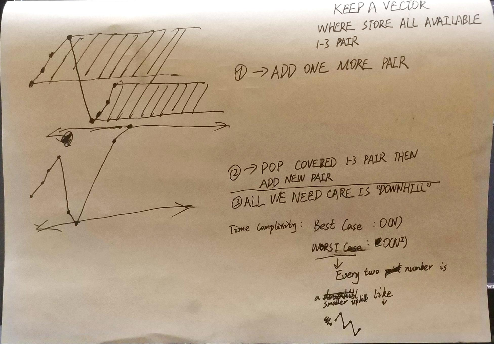

+++
title = "2020-10-23 Daily-Challenge"
path = "2020-10-23-Daily-Challenge"
date = 2020-10-23 00:33:22+08:00
updated = 2020-10-24 00:05:05+08:00
in_search_index = true

[taxonomies]
tags = ["Algorithm"]
categories = [ "DailyChallenge",]
archives = [ "archive",]
+++

Today I have done *Largest Number* on [leetcode](https://leetcode.com/problems/largest-number/) and leetcode's [October LeetCoding Challenge](https://leetcode.com/explore/challenge/card/october-leetcoding-challenge/562/week-4-october-22nd-october-28th/3505/) with `cpp`.

<!-- more -->

# Add One Row to Tree

## Description

Given a list of non-negative integers `nums`, arrange them such that they form the largest number.

**Note:** The result may be very large, so you need to return a string instead of an integer.

 

**Example 1:**

```
Input: nums = [10,2]
Output: "210"
```

**Example 2:**

```
Input: nums = [3,30,34,5,9]
Output: "9534330"
```

**Example 3:**

```
Input: nums = [1]
Output: "1"
```

**Example 4:**

```
Input: nums = [10]
Output: "10"
```

**Constraints:**

- `1 <= nums.length <= 100`
- `0 <= nums[i] <= 109`

## Solution

not very obvious solution

``` cpp
class Solution {
public:
  string largestNumber(vector<int>& nums) {
    vector<string> tmp;
    string answer = "";
    for (auto i : nums) {
      tmp.push_back(to_string(i));
    }
    sort(tmp.begin(), tmp.end(), [](const string& a, const string& b) {
      return a+b>b+a;
    });
    for (auto &s : tmp) {
      answer += s;
    }
    return answer[0]=='0'?"0":answer;
  }
};
```

# October LeetCoding Challenge23

## Description

**132 Pattern**

Given an array of `n` integers `nums`, a **132 pattern** is a subsequence of three integers `nums[i]`, `nums[j]` and `nums[k]` such that `i < j < k` and `nums[i] < nums[k] < nums[j]`.

Return *`true` if there is a **132 pattern** in `nums`, otherwise, return `false`.*

**Follow up:** The `O(n^2)` is trivial, could you come up with the `O(n logn)` or the `O(n)` solution?

**Example 1:**

```
Input: nums = [1,2,3,4]
Output: false
Explanation: There is no 132 pattern in the sequence.
```

**Example 2:**

```
Input: nums = [3,1,4,2]
Output: true
Explanation: There is a 132 pattern in the sequence: [1, 4, 2].
```

**Example 3:**

```
Input: nums = [-1,3,2,0]
Output: true
Explanation: There are three 132 patterns in the sequence: [-1, 3, 2], [-1, 3, 0] and [-1, 2, 0].
```

**Constraints:**

- `n == nums.length`
- `1 <= n <= 104`
- `-109 <= nums[i] <= 109`

## Solution

I write a ugly solution and follow by a quick explanation

``` cpp
class Solution {
public:
  bool find132pattern(vector<int> &nums) {
    if(nums.size() < 3) return false;
    vector<pair<int, int>> s;
    int one = 0, three = -1;
    for(int i = 1; i < nums.size(); ++i) {
      while(i < nums.size() && nums[i] <= nums[i-1]) {
        one = i;
        i += 1;
      }
      if(i == nums.size()) break;
      while(i < nums.size() && nums[i] >= nums[i-1]) {
        for(auto &p : s) {
          if(nums[i] > p.first && nums[i] < p.second) {
            return true;
          }
        }
        three = i;
        i += 1;
      }
      if(i == nums.size()) break;
      for(int j = s.size() - 1; j >= 0; --j) {
        if(s[j].second <= nums[three]) {
          s.pop_back();
        } else {
          break;
        }
      }
      s.push_back(make_pair(nums[one], nums[three]));
      for(auto &p : s) {
        if(nums[i] > p.first && nums[i] < p.second) {
          return true;
        }
      }
      one = i;
    }
    return false;
  }
};
```



I rewrite it into a ... more ugly version?


``` cpp
class Solution {
public:
  bool find132pattern(vector<int> &nums) {
    if(nums.size() < 3) return false;
    vector<pair<int, int>> s;
    int one = 0, three = -1, i = 1, c = 1, pc = 1;
    while(i < nums.size()) {
      switch (c) {
      case 1:
        if(nums[i] <= nums[i-1]) one = i;
        else pc = 3;
        break;
      case 3:
        if(nums[i] >= nums[i-1]) {
          for(auto &p : s) {
            if(nums[i] > p.first && nums[i] < p.second) {
              return true;
            }
          }
          three = i;
        } else {
          pc = 2;
        }
        break;
      case 2:
        for(int j = s.size()-1; j >=0 && s[j].second <= nums[three]; --j) {
          s.pop_back();
        }
        s.push_back(make_pair(nums[one], nums[three]));
        for(auto &p : s) {
          if(nums[i] > p.first && nums[i] < p.second) return true;
        }
        one = i;
        pc = 1;
      }
      i += pc==c;
      c = pc;
    }
    return false;
  }
};
```