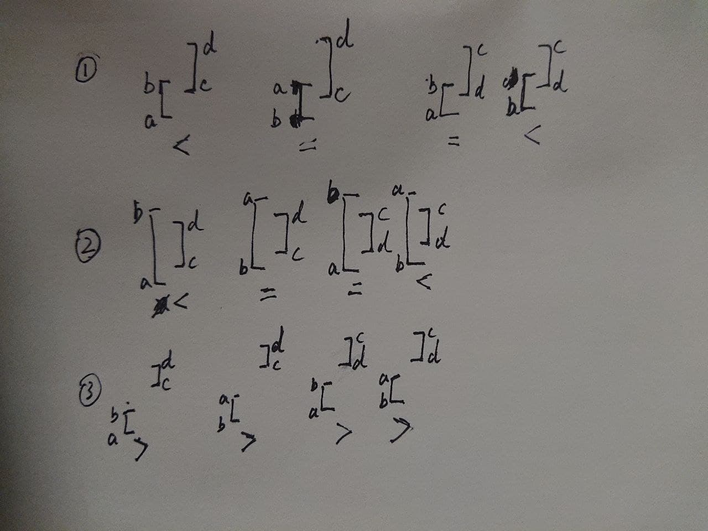

+++
title = "2021-03-21 Daily-Challenge"
path = "2021-03-21-Daily-Challenge"
date = 2021-03-21 02:16:32+08:00
updated = 2021-03-21 22:02:26+08:00
in_search_index = true

[taxonomies]
tags = ["Algorithm"]
categories = [ "DailyChallenge",]
archives = [ "archive",]
+++

Today is Sunday, I gonna review the tasks I've done this week, and finish today's leetcode's [March LeetCoding Challenge](https://leetcode.com/explore/challenge/card/march-leetcoding-challenge-2021/590/week-3-march-15th-march-21st/3679/) with `cpp`.


<!-- more -->

# LeetCode Review

## Reverse Subarray To Maximize Array Value

image array `[..., a, b, ... , c, d, ...]` and we reverse `[b, ..., c]`, array value is only change at pair(a, b) and pair(c, d), which turns into pair(a, c) and pair(b, d). So we want to maximize this change.

see this image



``` cpp
class Solution {
public:
  int maxValueAfterReverse(vector<int>& nums) {
    int minMax = INT_MAX;
    int maxMin = INT_MIN;
    int len = nums.size();
    int value = 0;
    for(int i = 1; i < len; ++i) value += abs(nums[i] - nums[i - 1]);
    
    for(int i = 1; i < len; ++i) {
      minMax = min(minMax, max(nums[i - 1], nums[i]));
      maxMin = max(maxMin, min(nums[i - 1], nums[i]));
    }
    
    int change = 2 * (maxMin - minMax);
    for(int i = 1; i < len; ++i) {
      change = max(change, abs(nums[0] - nums[i]) - abs(nums[i] - nums[i - 1]));
    }
    for(int i = 0; i < len - 1; ++i) {
      change = max(change, abs(nums[len - 1] - nums[i]) - abs(nums[i] - nums[i + 1]));
    }
    return value + change;
  }
};
```

# March LeetCoding Challenge 21

## Description

**Reordered Power of 2**

Starting with a positive integer `N`, we reorder the digits in any order (including the original order) such that the leading digit is not zero.

Return `true` if and only if we can do this in a way such that the resulting number is a power of 2.

 


**Example 1:**

```
Input: 1
Output: true
```

**Example 2:**

```
Input: 10
Output: false
```

**Example 3:**

```
Input: 16
Output: true
```

**Example 4:**

```
Input: 24
Output: false
```

**Example 5:**

```
Input: 46
Output: true
```

 

**Note:**

1. `1 <= N <= 10^9`

## Solution

``` cpp
// sorted powers of 2
const set<string> st = {"011237","0122579","012356789","0124","0134449","0145678","01466788","0248","0368888","0469","1","112234778","11266777","122446","125","128","1289","13468","16","2","224588","23","23334455","234455668","23678","256","35566","4","46","8"};
class Solution {
public:
  bool reorderedPowerOf2(int N) {
    string n = to_string(N);
    sort(n.begin(), n.end());
    return st.count(n);
  }
};
```
