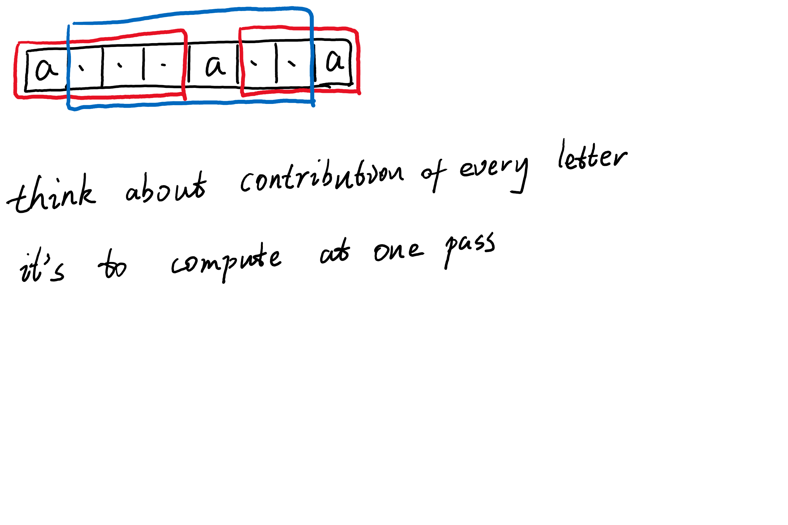

+++
title = "2021-04-02 Daily-Challenge"
path = "2021-04-02-Daily-Challenge"
date = 2021-04-02 15:45:52+08:00
updated = 2021-04-02 16:24:55+08:00
in_search_index = true

[taxonomies]
tags = ["Algorithm"]
categories = [ "DailyChallenge",]
archives = [ "archive",]
+++

Today I have done [Count Unique Characters of All Substrings of a Given String](https://leetcode.com/problems/count-unique-characters-of-all-substrings-of-a-given-string/) and leetcode's [April LeetCoding Challenge](https://leetcode.com/explore/featured/card/april-leetcoding-challenge-2021/593/week-1-april-1st-april-7th/3693/) with `cpp`.

<!-- more -->

# Count Unique Characters of All Substrings of a Given String

## Description

Let's define a function `countUniqueChars(s)` that returns the number of unique characters on `s`, for example if `s = "LEETCODE"` then `"L"`, `"T"`,`"C"`,`"O"`,`"D"` are the unique characters since they appear only once in `s`, therefore `countUniqueChars(s) = 5`.

On this problem given a string `s` we need to return the sum of `countUniqueChars(t)` where `t` is a substring of `s`. Notice that some substrings can be repeated so on this case you have to count the repeated ones too.

Since the answer can be very large, return the answer modulo `10 ^ 9 + 7`.

 

**Example 1:**

```
Input: s = "ABC"
Output: 10
Explanation: All possible substrings are: "A","B","C","AB","BC" and "ABC".
Evey substring is composed with only unique letters.
Sum of lengths of all substring is 1 + 1 + 1 + 2 + 2 + 3 = 10
```

**Example 2:**

```
Input: s = "ABA"
Output: 8
Explanation: The same as example 1, except countUniqueChars("ABA") = 1.
```

**Example 3:**

```
Input: s = "LEETCODE"
Output: 92
```

 

**Constraints:**

- `0 <= s.length <= 10^4`
- `s` contain upper-case English letters only.

## Solution

I've drawn a picture to illustrate my solution



``` cpp
const int MOD = 1e9 + 7;

class Solution {
public:
  int uniqueLetterString(string s) {
    int len = s.length();
    int answer = 0;
    for(int i = 0; i < 26; ++i) {
      int last2 = -1;
      int last1 = -1;
      int pos = 0;
      for(; pos < len; ++pos) {
        if(s[pos] == 'A' + i) {
          answer += (last1 - last2) * (pos - last1);
          answer %= MOD;
          last2 = last1;
          last1 = pos;
        }
      }
      if(last1 != -1) {
        answer += (len - last1) * (last1 - last2);
        answer %= MOD;
      }
    }
    
    return answer;
  }
};
```

# April LeetCoding challenge2

**Ones and Zeroes**

You are given an array of binary strings `strs` and two integers `m` and `n`.

Return *the size of the largest subset of `strs` such that there are **at most*** `m` `0`*'s and* `n` `1`*'s in the subset*.

A set `x` is a **subset** of a set `y` if all elements of `x` are also elements of `y`.

 

**Example 1:**

```
Input: strs = ["10","0001","111001","1","0"], m = 5, n = 3
Output: 4
Explanation: The largest subset with at most 5 0's and 3 1's is {"10", "0001", "1", "0"}, so the answer is 4.
Other valid but smaller subsets include {"0001", "1"} and {"10", "1", "0"}.
{"111001"} is an invalid subset because it contains 4 1's, greater than the maximum of 3.
```

**Example 2:**

```
Input: strs = ["10","0","1"], m = 1, n = 1
Output: 2
Explanation: The largest subset is {"0", "1"}, so the answer is 2.
```

 

**Constraints:**

- `1 <= strs.length <= 600`
- `1 <= strs[i].length <= 100`
- `strs[i]` consists only of digits `'0'` and `'1'`.
- `1 <= m, n <= 100`

## Solution

I come up with a solution with time complexity of $O(Accept)$, and I didn't expect it would be great solution, BUT...

``` cpp
class Solution {
public:
  int findMaxForm(vector<string>& strs, int m, int n) {
    int len = strs.size();
    int count[len][2];
    for(int i = 0; i < len; ++i) {
      count[i][0] = 0;
      count[i][1] = 0;
      for(auto c : strs[i]) count[i][c == '1'] += 1;
    }
    int dp[m + 1][n + 1];
    for(int i = 0; i <= m; ++i) {
      for(int j = 0; j <= n; ++j) dp[i][j] = -1;
    }
    int answer = 0;
    dp[0][0] = 0;
    for(int i = 0; i < len; ++i) {
      for(int zero = m; zero >= count[i][0]; --zero) {
        for(int one = n; one >= count[i][1]; --one) {
          if(dp[zero - count[i][0]][one - count[i][1]] == -1) continue;
          dp[zero][one] = max(dp[zero - count[i][0]][one - count[i][1]] + 1, dp[zero][one]);
          answer = max(answer, dp[zero][one]);
        }
      }
    }
    
    return answer;
  }
};

// Runtime: 44 ms, faster than 97.67% of C++ online submissions for Ones and Zeroes.
// Memory Usage: 8.6 MB, less than 99.46% of C++ online submissions for Ones and Zeroes.
```
